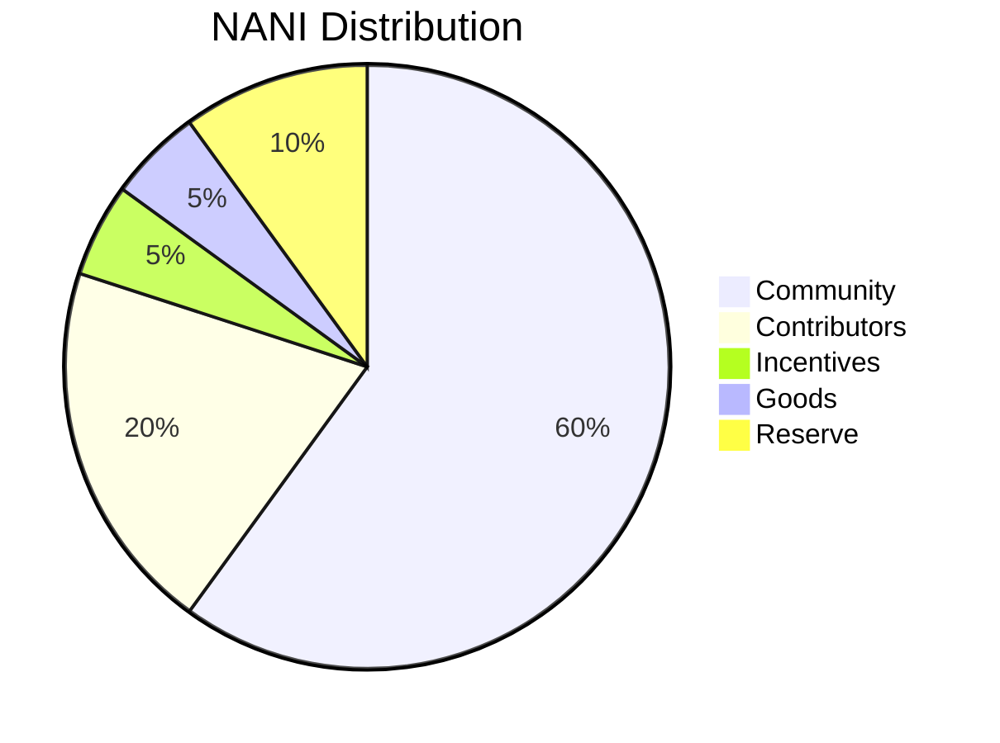

Nani DAO is a progressive [*DUNA*](https://a16zcrypto.com/posts/article/duna-for-daos/). Adopting the structure detailed in [*SF50*](https://a16zcrypto.com/posts/article/duna-for-daos/), the provisions of the Wyoming Decentralized Unincorporated Nonprofit Association (DUNA) Act, as well as the existing [*UNA Act*](https://law.justia.com/codes/wyoming/2022/title-17/chapter-22/), Nani DAO provides its members with the benefits of greater privacy, limited liability protection, and therefore more autonomy over making collective decisions for the DAO by limiting the prospect of unexpected legal interference.

*Formation Tx*: [0xc90f6e383c3e31ceb381b06564656edb5c2a379c3cfdae0d00b6f0fc9185d397](https://arbiscan.io/tx/0xc90f6e383c3e31ceb381b06564656edb5c2a379c3cfdae0d00b6f0fc9185d397#eventlog)

## DAO Distribution

| Category | Allocation | 
| -------- | -------- | 
| Community (Alpha)   | 10%     | 
| Community (Beta)   | 30%     | 
| Community (Vote)   | 20%     | 
| Partners    | 5%     | 
| Public Goods    | 5%     | 
| Contributors    | 20%     | 
| Reserve    | 10%     | 

## DAO Partners

### Direct Distribution

The DAO is targeting select communities to initialize its governance. These communities have been prioritized as they reflect emergent trends in onchain governance that we believe can immediately benefit this project.

Individual members of the following groups are eligible to claim governance shares in the DAO and DUNA entity:

- Moloch DAO
- Metacartel
- Milady NFT
- LexDAO NFT
- Developer DAO

### Delegate Distribution

The DAO wishes to engage with representatives of the following communities to kickstart broad decision-making capabilities:

- Arbitrum DAO
- Optimism DAO
- Uniswap DAO
- Gitcoin DAO
- ENS DAO

### Group Distribution

Select groups are also eligible for the DAO governance distribution. For convenience, as well to allow options around engaging their individual members, distributions are marked for their representatives or group accounts:

- LexPunk
- Raid Guild
- KALI DAO
- Seed Club
- Protocol Guild
- PublicHaus DAO

### Special Categories

During DAO alpha, certain participants engaged in incentivized activities:

- Nani DAO Discord
- Nani DAO NFT