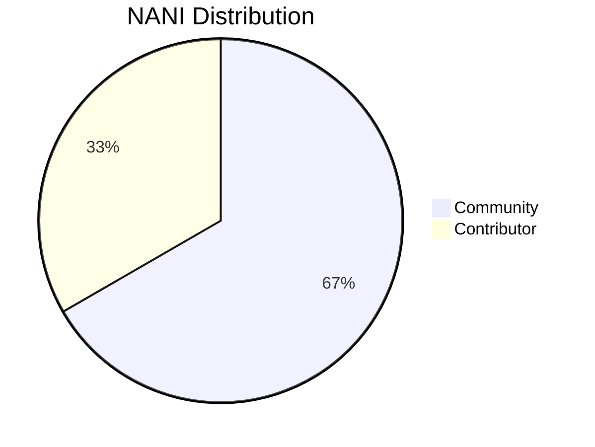

# NANI (⌘)

## DAO Distribution

>In Community category, 33.33% is reserved for DAO. 0.01% (or equivalent remainder), otherwise, for autonomous agent account ([agent.nani.eth](https://etherscan.io/address/0x466d3E0E6D661d6E7626e9dea93c460BD4e15B40))

## Community

[Beta testers](https://nani.ooo/) are eligible to receive daily points convertible to tokens on mainnet. This distribution, designed to highlight the vital role of testers and early adopters in co-creating experimental software, begins 11/1 and shall continue into next year, 1/11.

All initial points conversions shall occur through the [Points contract](https://etherscan.io/address/0xbEdfc889D4E2666f6C304df597b81122C3548968#code) on mainnet. Updated distributor contracts will be announced in the community Discord.

The Contributor admin account ([recovery.nani.eth](https://etherscan.io/address/0x0000000000001d8a2e7bf6bc369525A2654aa298)) will initially manage the Points contract balance until 33.33% of the NANI supply is claimed or otherwise distributed for Community purposes in accordance with the DUNA goal of incentivizing high quality contributors and long-term alignment. Specifically, the Community distributions will be on a first-come-first-serve basis until this allocated supply is exhausted, or until 1/11, at which point any remainder will be recovered into the DAO contract (in addition to the 33.33% reserved for DAO).

NO GUARANTEES ARE MADE AS TO THE FITNESS OF THIS DISTRIBUTION SOFTWARE. USERS SHOULD PROCEED AT THEIR OWN RISK.

IN addition, the following categories of accounts are eligible to claim membership via the claim page on [nani.ooo/claim](https://nani.ooo/claim) and review their allocation in this [CSV](https://nani.ooo/snaphot.csv):

### Direct Distribution

The DAO is targeting select communities to initialize its governance. These communities have been prioritized as they reflect emergent trends in onchain governance that we believe can immediately benefit this project.

Individual members of the following groups are eligible to claim governance shares in the DAO and DUNA entity:

- moloch dao
- metacartel
- milady nft
- lexdao nft
- raid guild
- dev dao

### Delegate Distribution

The DAO wishes to engage with representatives of the following communities to kickstart broad decision-making capabilities:

- Arbitrum DAO
- Optimism DAO
- Uniswap DAO
- Gitcoin DAO
- ENS DAO

### Group Distribution

Select groups are also eligible for the DAO governance distribution. For convenience, as well to allow options around engaging their individual members, distributions are marked for their representatives or group accounts:

- LexPunk
- KALI DAO
- Seed Club
- Protocol Guild
- PublicHaus DAO

## Contributor

33.33% is reserved for contributors, held in the admin multisig ([recovery.nani.eth](https://etherscan.io/address/0x0000000000001d8a2e7bf6bc369525A2654aa298)). This amount will be unlocked after the Community distribution periods have concluded and streamed over the course of the next following six months to an 0xsplits contract under admin discretion, with the goal of activating retroactive rewards for building the initial NANI protocols and to sustain dedicated protocol development well into the future.

## Protocol Governance

Account abstraction but also economic abstraction is a goal of [NANI accounts infra](https://github.com/NaniDAO/accounts).

The following protocols are subject initially to DAO governance:

* Intents Engine (naming and tx routing)
* Accounts Factory (upgrades and validators)
* NEETH Paymaster (cost settings and fees)

The [nani.eth ENS domain](https://app.ens.domains/nani.eth) is also under DAO governance. Broadly all NANI applications, including agent references, should be hosted and updated there after beta in the sense of [hyperapps](https://www.pentagon.xyz/hyperapps.html). End-game: NANI DUNA governs common meaning infra like naming primitives, agent alignment, and contract singletons in the shape of a true [hyperstructure](https://jacob.energy/hyperstructures.html). Or, *unstoppable onchain infra for agents and their owners*.

## Protocol Utility

Goods such as large open language model access should be experimented with and ideally be curated to fit real user preferences. Staking for access to the latest models and non-rate-limited access will be discussed with the community.

## Protocol Fees

Participation in DAO activities will be compensated or otherwise rewarded with NEETH, NANI or other protocol fees (e.g., model usage, tx relaying, etc.) in line with the selected DAO legal structure, *DUNA* (see below).

## Legal Structure

Nani DAO is a progressive [*DUNA*](https://a16zcrypto.com/posts/article/duna-for-daos/). Adopting the structure detailed in [*SF50*](https://a16zcrypto.com/posts/article/duna-for-daos/), the provisions of the Wyoming Decentralized Unincorporated Nonprofit Association (DUNA) Act, as well as the existing [*UNA Act*](https://law.justia.com/codes/wyoming/2022/title-17/chapter-22/), Nani DAO provides its members with the benefits of greater privacy, limited liability protection, and therefore more autonomy over making collective decisions for the DAO by limiting the prospect of unexpected legal interference.

Governance occurs by means of the DAO smart contract on Ethereum, Arbitrum and Base chains at [`0xDa000000000000d2885F108500803dfBAaB2f2aA`](https://contractscan.xyz/contract/0xDa000000000000d2885F108500803dfBAaB2f2aA) and the [xNANI token](https://etherscan.io/address/0x000000000000629d5f7ce20b868d0ac1739104b9#code). xNANI can be minted by the public by staking NANI tokens distributed to community and contributors as detailed further above.

*Formation Tx*: [0xc90f6e383c3e31ceb381b06564656edb5c2a379c3cfdae0d00b6f0fc9185d397](https://arbiscan.io/tx/0xc90f6e383c3e31ceb381b06564656edb5c2a379c3cfdae0d00b6f0fc9185d397#eventlog)
